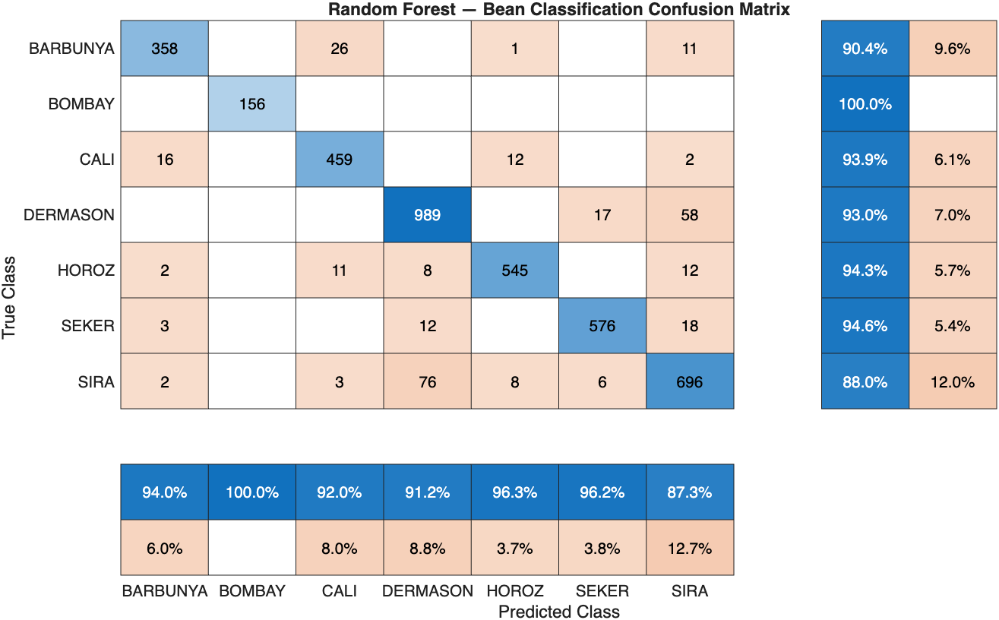
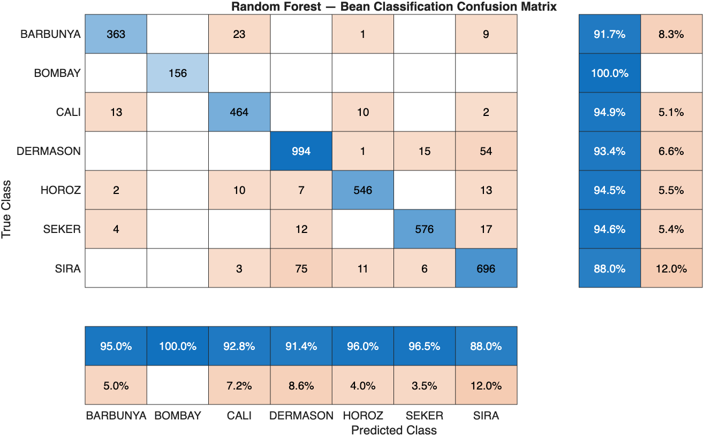
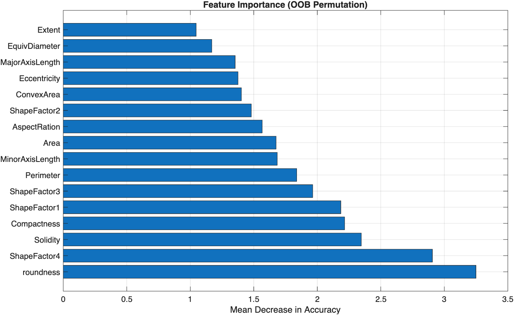

# Bean Type Classification Using Random Forest
**Course:** [Your Course Name]  
**Author:** [Your Name]  
**Dataset:** Dry Bean Dataset — Koklu, M. and Ozkan, I.A. (2020). *Multiclass Classification of Dry Beans Using Computer Vision and Machine Learning Techniques.* Computers and Electronics in Agriculture, 174, 105507. [https://doi.org/10.1016/j.compag.2020.105507](https://doi.org/10.1016/j.compag.2020.105507)

---

## Table of Contents
1. [Problem Description & Initial Prompt](#1-problem-description--initial-prompt)
2. [Background: Random Forest](#2-background-random-forest)
3. [Code 1: Baseline Model](#3-code-1-baseline-model)
4. [Code 2: Tuned Model & Hyperparameter Discussion](#4-code-2-tuned-model--hyperparameter-discussion)
5. [Feature Importance](#5-feature-importance)

---

## 1. Problem Description & Initial Prompt

The goal of this project is to build a machine learning model that can predict the **type of dry bean** from geometric measurements. The dataset contains **13,611 samples**, each described by **16 continuous geometric features** (such as area, perimeter, major axis length, roundness, etc.) and labeled with one of **7 bean types**: BARBUNYA, BOMBAY, CALI, DERMASON, HOROZ, SEKER, and SIRA.

This is a **multiclass classification problem** — given a set of shape measurements, the model must decide which of the 7 bean types a sample belongs to.

### Initial Prompt Given to LLM

> "I would like to do a machine learning project where the goal is to predict the type of bean from geometric measurements. I have a CSV file dataset where there are 16 different variables with 7 beans that are the target guesses. Can we talk about the best way to model this dataset and approach the project? There are several suggestions/approaches we should take including random forest and neural networks and including a confusion matrix to help see where the model is going wrong."

The LLM outlined a full pipeline: data preprocessing, model selection, train/test splitting, confusion matrix evaluation, and iteration. It suggested **Random Forest as the primary model**, with SVM and Neural Networks as comparison points. The reasoning was that Random Forest is naturally suited to multiclass tabular data, requires no feature scaling, handles correlated features well, and provides built-in feature importance rankings — all of which are directly relevant to this dataset.

---

## 2. Background: Random Forest

### Why Random Forest?

Random Forest was chosen as the modeling approach for several reasons specific to this problem:

- The 16 geometric features are likely **correlated** (e.g., area and perimeter scale together), and Random Forest handles correlated features gracefully by randomly subsampling features at each split
- The target variable has **7 classes**, and Random Forest handles multiclass problems natively through majority voting across trees
- No **feature scaling** is required, unlike neural networks or SVMs
- The model produces **feature importance scores**, which gives interpretable insight into which geometric measurements matter most for classification
- It is robust against overfitting because the randomness built into each tree acts as a natural regularizer

### How Random Forest Works

A single **decision tree** splits data by asking threshold questions about features until a classification is reached. However, a single tree tends to overfit — it memorizes the training data and performs poorly on new data.

A **Random Forest** addresses this by building hundreds of independent trees and combining their votes. The class receiving the most votes wins. Two sources of randomness are injected deliberately:

1. **Bootstrap Sampling (Bagging):** Each tree is trained on a different random sample of the data, drawn with replacement. Some samples appear multiple times; others not at all. This forces diversity between trees.

2. **Random Feature Subsets:** At every split point within every tree, only a random subset of features (default: √16 = 4) is considered as a candidate for splitting. This prevents all trees from making identical splits and ensures they are decorrelated.

Because each tree makes different errors, those errors cancel out across the ensemble — the combined prediction is more stable and accurate than any individual tree.

As the LLM explained:

> "Many imperfect models combined outperform any single perfect-looking model."

### Confusion Matrix

A confusion matrix is used to evaluate multiclass performance beyond simple accuracy. The diagonal shows correct predictions per class. Off-diagonal entries reveal *which* classes are being confused with each other — providing both diagnostic and scientific insight into which bean types are geometrically similar.

---

## 3. Code 1: Baseline Model

The baseline model was implemented in MATLAB using the Statistics and Machine Learning Toolbox. The dataset was loaded from the `.xlsx` file and split 70/30 into training and test sets using stratified sampling to preserve class proportions.

**See code:** [`code_1/bean_classification.m`](code_1/bean_classification.m)

### Baseline Hyperparameters

| Parameter | Value |
|---|---|
| Number of Trees | 100 |
| MinLeafSize | 1 |
| NumPredictorsToSample | √16 = 4 (default) |
| Train/Test Split | 70% / 30% stratified |

### Baseline Results

**Overall Test Accuracy: 92.75%**

| Bean Type | Precision | Recall | F1 Score |
|---|---|---|---|
| BARBUNYA | 0.945 | 0.907 | 0.925 |
| BOMBAY | 1.000 | 1.000 | 1.000 |
| CALI | 0.920 | 0.941 | 0.930 |
| DERMASON | 0.914 | 0.934 | 0.924 |
| HOROZ | 0.965 | 0.941 | 0.953 |
| SEKER | 0.962 | 0.946 | 0.954 |
| SIRA | 0.876 | 0.882 | 0.879 |

### Baseline Confusion Matrix

### Discussion

The baseline model achieved strong performance at 92.55%. Notable observations:

- **BOMBAY** achieved a perfect 1.000 across all metrics, indicating it is geometrically very distinct from all other bean types
- **SIRA** had the weakest performance (F1 = 0.879), with 75 actual SIRA samples being misclassified as DERMASON — the largest single source of error in the entire model
- **BARBUNYA** had the second-lowest recall at 90.7%, with misclassifications spreading toward both CALI (24 samples) and SIRA (12 samples), suggesting BARBUNYA sits geometrically between these two classes in feature space
- The OOB error plot showed the model stabilizing at approximately 40 trees, meaning anything beyond ~50 trees provides no additional accuracy benefit

---

## 4. Code 2: Tuned Model & Hyperparameter Discussion

### What Are Hyperparameters?

A **hyperparameter** is a setting that controls how the learning process works — it is chosen before training and never adjusted by the model itself. In contrast, a regular model parameter (like which feature to split on) is learned from the data.

For Random Forest, the key hyperparameters are:

- **Number of Trees:** More trees increases stability but with diminishing returns. The OOB error plot showed convergence around 40–50 trees for this dataset, so reducing from 100 to 50 maintained accuracy while cutting computation time.
- **NumPredictorsToSample:** The number of features randomly considered at each node split. Default is √p = 4. Lower values increase tree diversity; higher values make individual splits stronger but trees more correlated with one another.
- **MinLeafSize:** Controls tree depth by requiring a minimum number of samples at each leaf. Smaller values allow deeper trees; larger values produce shallower, more generalized trees.

### Tuning Process

Bayesian optimization was run using MATLAB's `fitcensemble` with `OptimizeHyperparameters = 'auto'` over 30 trials. The optimizer explored three ensemble methods — Bag, AdaBoostM2, and RUSBoost — and converged on **Bag (Random Forest) with MinLeafSize = 2 and ~497 trees** as the best configuration. This confirmed Random Forest as the correct method for this dataset.

The optimized model returned 92.63% accuracy, marginally above the baseline 92.55%, confirming the original model was already near-optimal. The key finding was that **MinLeafSize = 2** (slightly shallower trees) was preferred. The number of trees was reduced to **50** based on the OOB error plot plateauing near 40 trees, and a sweep of `NumPredictorsToSample` values was run to find the best feature sampling rate at 16.

**See code:** [`code_2/bean_classification_tuned.m`](code_2/bean_classification_tuned.m)

### Tuned Hyperparameters

| Parameter | Baseline | Tuned |
|---|---|---|
| Number of Trees | 100 | 50 |
| MinLeafSize | 1 | 2 |
| NumPredictorsToSample | 4 (default) | 16 |

### Tuned Results

**Overall Test Accuracy: 92.95%**

| Bean Type | Precision | Recall | F1 Score |
|---|---|---|---|
| BARBUNYA | 0.950 | 0.917 | 0.933 |
| BOMBAY | 1.000 | 1.000 | 1.000 |
| CALI | 0.928 | 0.949 | 0.938 |
| DERMASON | 0.914 | 0.934 | 0.924 |
| HOROZ | 0.960 | 0.945 | 0.952 |
| SEKER | 0.965 | 0.946 | 0.955 |
| SIRA | 0.880 | 0.880 | 0.880 |

### Tuned Confusion Matrix

### What Changed Between Models

The tuned model improved overall accuracy from 92.55% to 92.95% — a modest but consistent gain achieved with half the number of trees (50 vs. 100), demonstrating that the OOB plateau analysis was correct. The most notable per-class improvements were in **BARBUNYA**, where recall rose from 90.7% to 91.7% and F1 improved from 0.925 to 0.933, and in **CALI**, where recall improved from 94.1% to 94.9%. **SIRA** remained the hardest class to classify correctly, with 75 samples still being misclassified as DERMASON in both models — suggesting this confusion reflects a genuine geometric overlap between these two bean types that is difficult to resolve with shape features alone. **BOMBAY** remained perfect across both models.

---

## 5. Feature Importance

The Random Forest model tracks which features contribute most to correct classifications by measuring how much accuracy drops when each feature is randomly permuted — this is called **OOB permutation importance**. A higher mean decrease in accuracy means removing that feature hurts the model more, making it more important.

### Feature Importance Plot

### Discussion

The results show a clear separation between high-impact shape descriptors and low-impact size measurements. **ShapeFactor4, Compactness, and Roundness** are the three most important features by a significant margin, all exceeding a mean decrease in accuracy of 4.0. These are all **ratio-based shape descriptors** — they capture how circular or elongated a bean is, independent of its absolute size. This makes intuitive sense: two beans of different sizes but the same species will have similar shape ratios, making these features robust class discriminators.

**MajorAxisLength and Solidity** rank in the middle tier, contributing meaningfully but less so than the pure shape ratios. Interestingly, **Area and Perimeter** — the most visually obvious geometric measurements — rank relatively low, suggesting that raw size alone is a weak predictor of bean type compared to shape.

The three near-zero features — **ShapeFactor3, EquivDiameter, and Eccentricity** — contribute almost nothing to the model's predictions. This likely reflects redundancy: equivalent diameter is mathematically derived from area, and eccentricity captures similar elongation information already encoded in the top-ranked shape factors. These features could be dropped from a future model iteration with minimal accuracy loss, which would simplify the model and reduce noise.

The persistence of SIRA/DERMASON confusion in the confusion matrix is consistent with these findings — if both classes score similarly on the top shape ratio features, the model has limited geometric information to separate them.
